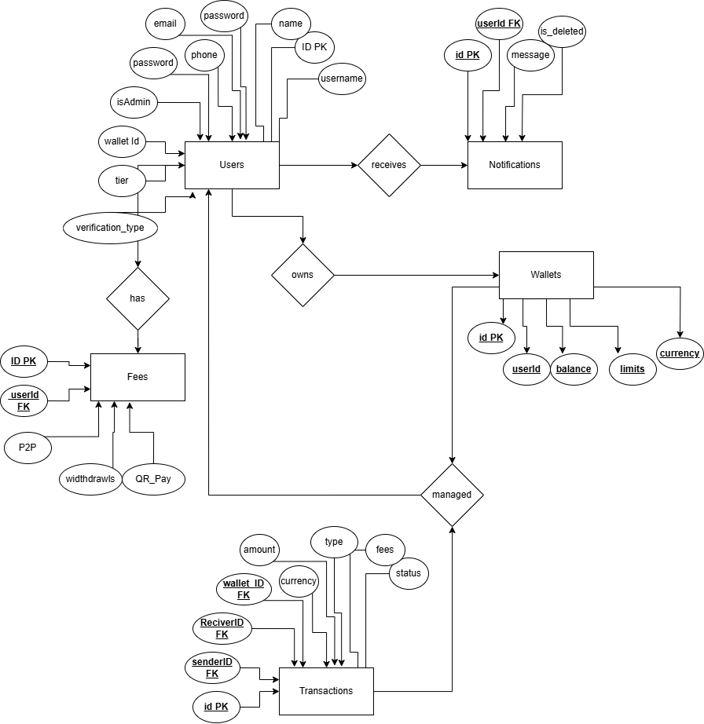

# X-Wallet Platform

## 🚀 Project Overview
X-Wallet is a secure and user-friendly **digital wallet platform** that allows users to manage transactions, store digital assets, and integrate with external payment APIs.

---

## 📌 Hosting Details

| **Service**    | **Details** |
|---------------|------------|
| **Server IP** | `http://15.236.225.13/` |
| **GitHub Repo** | [X-Wallet Platform](https://github.com/mahditalalDev/x-wallet-platform) |
| **Live Demo** | [GitHub Pages URL](https://mahditalaldev.github.io/x-wallet-platform/x-wallet-client/authentication/login.html) |

---

## 📊 ER Diagram (Entity-Relationship Diagram)
Below is the ER Diagram representing the database structure of X-Wallet.

---

## 📡 API Documentation
The platform integrates external APIs for payment processing, authentication, and data management. Refer to the **API Documentation** for details on endpoints, request formats, and responses.

📌 **API Documentation:** [View API Docs](https://documenter.getpostman.com/view/33828343/2sAYdmjSow)

---

## 🔥 Features
✅ Secure digital transactions  
✅ User authentication & authorization  
✅ External API integrations  
✅ Responsive UI/UX  
✅ Admin panel for management  

---

## 🤝 Contributors
👤 **Mahdi Talal** - [GitHub](https://github.com/mahditalalDev)  

---

## 📞 Contact
For inquiries or support, reach out via **[mahdi@example.com](mailto:mahditalal.789@gmail.com)** or open an issue in the repository.

---

🚀 *X-Wallet - Your Secure Digital Finance Partner!*

